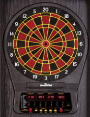
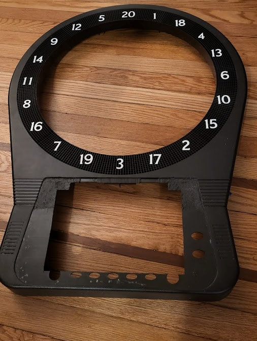
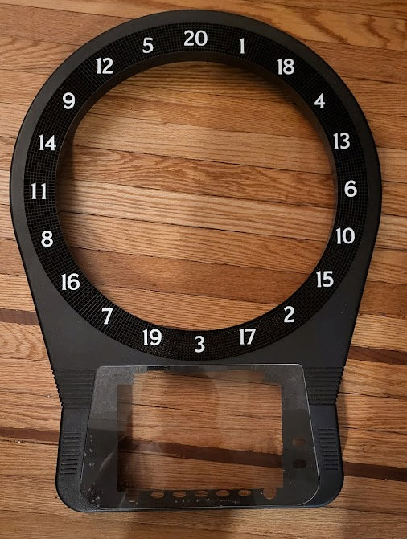
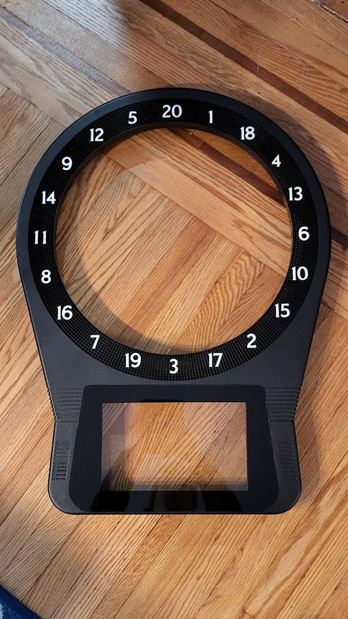
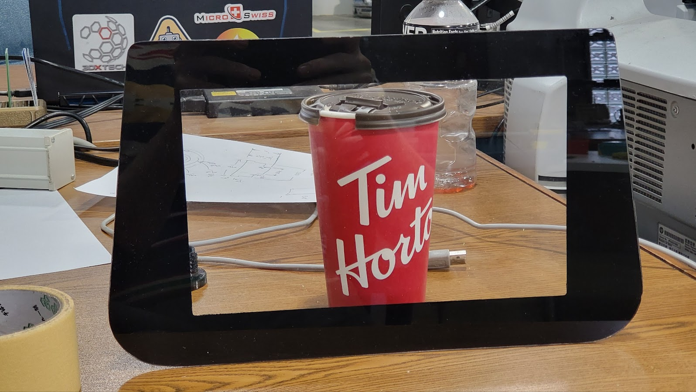

# Championship Darts

## Based on
[opendarts](https://www.hackster.io/ricardo-alves/opendarts-homemade-dartboard-machine-2a2914)

## Back story
I didn't like the idea of relying on a windows application to be able to play bar style darts again. I also prefer the arachnid software over other software. So I set out to make my own arachnid bar darts as I wasn't going to pay 4000 dollars of my heard earned cash to be able to play at home. 

Currently, cricket is mostly functional, over time I will clean it up and remove the need for a keyboard to start and stop the game. 

I've tested it on multiple SBC's including [Raspberry Pi 3B v1.3](https://a.co/d/btOSARu), and [Libre AML-S905X-CC](https://a.co/d/7vq5fVP). 

## Parts:
| Part|Price|
|-----|-----|
|[Sacrificial LED board](https://a.co/d/8JknjLO)| $110.00|
|[Dartboard and Stand](https://a.co/d/3aoWsLj)| $316.00|
|[10.1" Display](https://a.co/d/146ZyvZ)| $54.00|
|[Vibration Sensor](https://a.co/d/aGIvkeA)| $6.00|
|[Two Arduino Megas](https://a.co/d/6cQNrgW)|$44.00 |
|[Arduino Cases with Screw Terminals](https://a.co/d/fK4MR3x)| $96.00|
|[Arcade Buttons](https://a.co/d/25qAmpk)| $15.00|
|Total | $641.00|

* First Arduino drives dartboard hits and responses, vibration sensor for detecting board strikes that didn't actually land, and the button responses from the 5 aracde buttons (up, down, left, right, and enter)
* Second Arduino drives the LED board and game button lights 
    * The second arduino is really only useful to use if you get the LED lights, these are not necessary and the code can easily be modified to put the LED lights for the buttons into the dartboard driver. I only did it this way because it was an after thought. 

## What I did

* Taking the original dartboard, and disassembling it was a breeze.

* Once the electronics are removed, the painful process of using a dremel to create a cavity for the monitor begins.

* Drop in a custom cut piece of plexiglass

* Mask off where the monitor will display, and spraypaint the rest of the plexiglass to hide the edges.

* Once the plexiglass has been epoxied down so it is now fused to the panel, tape in your monitor. I just used gorilla tape to hold it up against the plexiglass.

More to come...